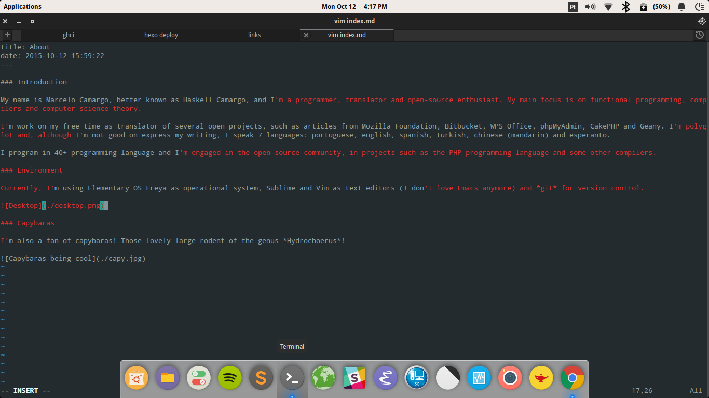

### Introduction

My name is Marcelo Camargo, better known as Haskell Camargo, and I’m a programmer, translator and open-source enthusiast based in Joinville/SC - Brazil. My main focus is on functional programming, compilers and computer science theory.
In my free time, I work as translator of several open projects, such as articles from Mozilla Foundation, Bitbucket, WPS Office, phpMyAdmin, CakePHP and Geany. I’m polyglot and, although I’m not good on express my writing, I speak 7 languages: portuguese, english, spanish, turkish, chinese (mandarin) and esperanto.
I program in 40+ programming languages and I’m engaged in the open-source community, in projects such as the PHP programming language and some other compilers.

### Environment

Currently, I’m using *Elementary OS Freya* as operational system, *Sublime* and *Vim* as text editors (I don’t love *Emacs* anymore) and *git* for version control.

### Capybaras

I’m also a fan of capybaras! Those lovely large rodent of the genus *Hydrochoerus*!

